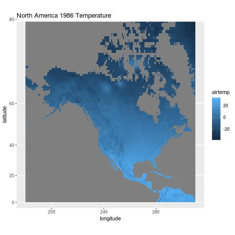
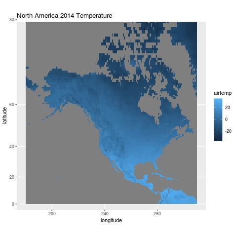
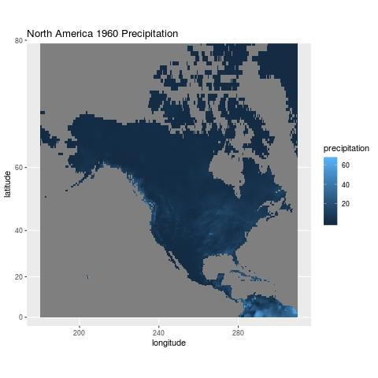
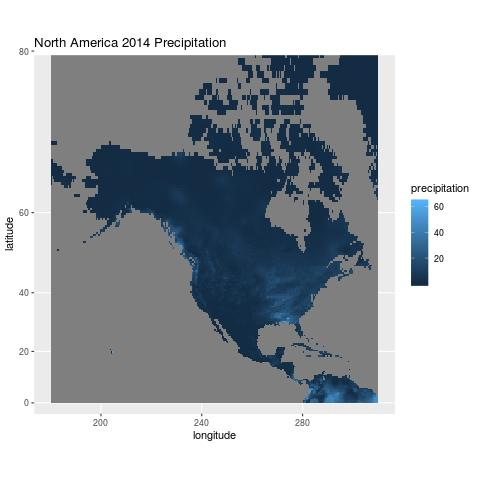

```{r setup, include=FALSE}
knitr::opts_chunk$set(echo = FALSE)
```

## Data

In this report, we will be using a air temperature and precipitation data set from the University of Delaware in order to create temperature and precipitation maps for North America in the month of April in 1960, 1986, and 2014.

## Temperature

```{r, echo=FALSE, fig.cap="", out.width = '30%'}



```

From 1960 - 2014, it seems that that the mean monthly air temperature (C) in North America has decreased. When we 
compare the 3 maps, we can see the blue gradually becomes darker it is not a major difference but it is noticeable. The temperature patterns seem reasonable as the data is collected in April, a relatively cool part of the year. We also know that climate change also has an affect in temperatures and so it could be an explanation for the decrease in temperatures.

## Precipitation

```{r, echo=FALSE, fig.cap="", out.width = '30%'}



```

From 1960 - 2014, it seems that the monthly sum (cm) of precipitation in North America has increased in the Western and South Eastern North America by a major amount. The blue is clearly a lot lighter meaning is has faced an increase of at least 20cm more precipitation. As said in my temperature analysis, climate change is a possible explanation for this increase. So, the precipitation patterns look reasonable despite the major difference.
